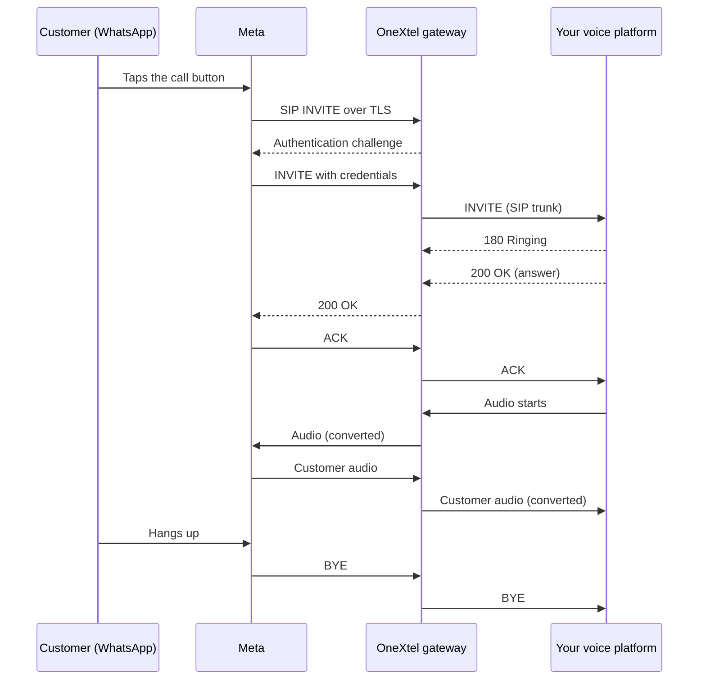

This page follows one call from the moment a customer taps the call button to the moment it ends.

## The call flow

<Steps>
  <Step title="The customer calls">
    The customer taps the call button in the chat with your WhatsApp Business number.
    The button is shown on iPhone and Android. Calls from WhatsApp on the web or desktop are not supported
    by Meta.
  </Step>
  <Step title="Meta sends the call to OneXtel">
    Meta places the call to the OneXtel gateway over SIP on TLS. The gateway asks Meta to authenticate
    with the credentials generated for your number, and accepts only calls that authenticate and that come from Meta's networks.
  </Step>
  <Step title="The gateway finds your trunk">
    Each WhatsApp number is linked to one or more SIP trunks that you provided. The gateway tries them
    in priority order, and moves to the next if one does not answer in time.
  </Step>
  <Step title="Your platform answers">
    Your voice platform receives a normal SIP INVITE and answers it. The caller's WhatsApp number is
    carried in the SIP **From** header, and your WhatsApp Business number in the request address.
  </Step>
  <Step title="Audio flows both ways">
    The gateway carries the audio between Meta and your platform. WhatsApp uses encrypted audio with
    the Opus codec. If your platform prefers G.711, the gateway converts between the two.
  </Step>
  <Step title="The call ends">
    Either side hangs up, and the gateway closes the call on both legs and records the result.
  </Step>
</Steps>

<Warning>
WhatsApp waits for the business side to send audio first. After your platform answers, it must start
sending audio (a greeting, music, or silence packets) straight away. If it only listens, neither side
sends anything and the caller hears silence.
</Warning>

## Number states

A WhatsApp number moves through these stages during onboarding. You see them in the call record and in
conversations with your account team.

| Stage | Meaning |
| --- | --- |
| Draft | The number is registered with OneXtel. Nothing has changed at Meta yet. |
| Configured | Calling is enabled at Meta, the SIP connection is set, and at least one trunk is attached. The number can take calls. |

Calls to a number that is not configured are refused.

## What happens when something fails

| Situation | What the gateway does |
| --- | --- |
| Your trunk does not answer within the failover time (3 seconds by default), or replies with a 5xx or timeout | It tries the next trunk in priority order. |
| Your trunk rings but does not answer within its ring limit | It cancels that trunk and tries the next one. |
| Your trunk replies with a busy, unavailable or decline | If the trunk is set to try the next trunk, it moves on. Otherwise the result is passed back to the caller as it is. |
| Every trunk is unavailable or at its call limit | The call is refused. |
| The number is not configured, or the call does not come from Meta | The call is refused. |

## Related

- [Connect your voice platform](/guides/whatsapp-voice/connect-your-voice-platform)
- [Protocols and media](/guides/whatsapp-voice/protocols-and-media)
- [Troubleshooting](/guides/whatsapp-voice/troubleshooting)
